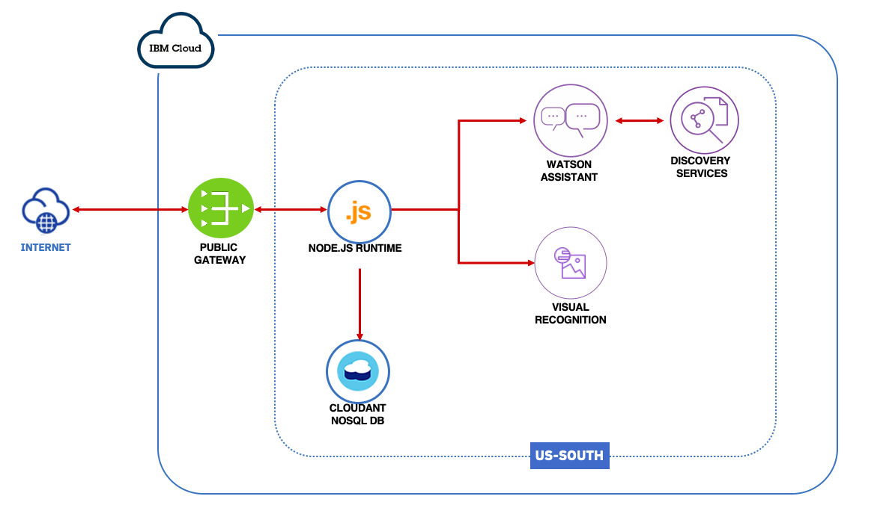

Eco Logic
========

Eco Logic is a Call For Code 2020 hackathon solution.  
We are currently in our beta version. We can guide you on recycling some plastics, styrofoam, cardboard and some food packaging. We hope to add recycling guides for other types of objects in the near future.

Vist our [Web Page](http://ecologic-2020.mybluemix.net/).
Find us on [Facebook](https://www.facebook.com/Eco-Logic-107364791033184) (We are Live!).

Check our [demo](public/demo.mp4) !

Uses a forked version of the Call for Code Community Collaboration Starter Kit.

Architecture
===========

* User connects through interface (at the moment facebook messenger)
* Backend Developed in NodeJS deployed in Cloud Foundry
* Visual Recognition detects objects related to recycling
* Watson Assistant manages the conversation flow
* The assistant uses the discovery to search more information about recycling
* Cloudant is our database for the recycling events dashboard

Development
===========

* Copy .env.example to .env
* Replace varibles in .env
* `npm install`
* `npm start`

Deployment
==========

* `ibmcloud login` # there is an account just for this project
* `ibmcloud target --cf`
* `ibmcloud app push`
* `ibmcloud app list`

Resources
==========

* Used public photos from the web and from public image repositories like [Trashnet](https://github.com/garythung/trashnet) and [Open Recycle](https://github.com/openrecycle/dataset)
* Discovery Search Skill trained with information from [Recycling Simplified](https://recyclingsimplified.com/) and [Earth 911](https://earth911.com/) 
